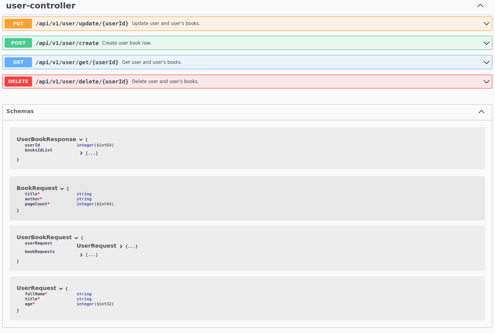

# Spring Boot App
Бекенд приложение с использованием Spring Boot, где
реализован простой REST API с основными CRUD-операциями, в качестве хранилища используется - **Postgressql**, для доступа к БД - **Spring Data JPA**, а в качестве системы миграции бд - **Liquibase**. Также написаны unit тесты и инеграционные тесты с БД.

**swagger**:
   

    

